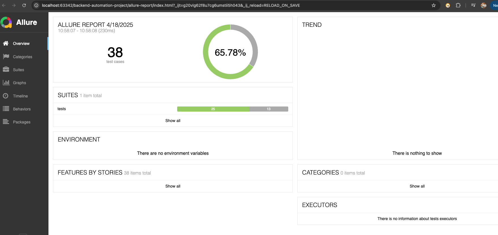
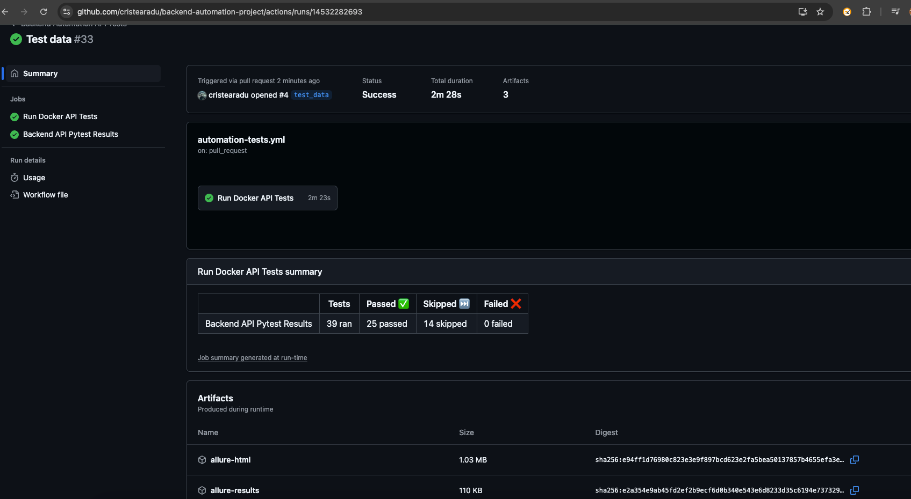

# 👨‍💻 Backend Automation Project – Automated Test Suite

[](https://github.com/cristearadu/backend-automation-project/actions/workflows/automation-tests.yml)

---

## ✨ Key Features

- Fully automated API testing using **Python + Pytest**.
- Built-in support for **Docker Compose** for full environment setup.
- **Allure Reports** + **HTML Reports** generation.
- CI/CD ready with **GitHub Actions**.

---

## 👾 Tech Stack

| Technology | Usage |
|:---|:---|
| Python 3.10 | Test automation language |
| Pytest | Test framework |
| Docker Compose | Environment orchestration |
| JS Server | Mock API for testing |
| Allure | Advanced reporting |
| GitHub Actions | Continuous Integration |

---

## ⚖️ Design Patterns Used

| Pattern | Why Used |
|:---|:---|
| Service Object Pattern | Encapsulates API actions into service classes |
| Builder Pattern | For flexible test data creation |
| Factory Pattern | Dynamically switch between different API endpoints |
| Request Object Model | Structured HTTP request generation |
| Layered Architecture | Clean separation of concerns |

---

## 🛋️ Directory Structure

```bash
backend-automation-project/
|-- .github/workflows/api-tests.yml   # GitHub Actions CI/CD
|-- core/                             # Core utilities and HTTP dispatcher
|-- helpers/                          # API helpers and service objects
|-- request_builders/                 # Modular request builders
|-- schemas/                          # JSON schema validations
|-- tests/                            # Test cases organized by feature
|-- create_db.js                      # Script to generate db.json
|-- docker-compose.yml                # Service orchestration
|-- requirements.txt                  # Python dependencies
|-- pytest.ini                        # Pytest configuration
```

---

## 🔄 Getting Started

### 1. Install Dependencies
```bash
npm install
npm start
pip install -r requirements.txt
```

### 2. Run Tests Locally

- Run via docker (how it runs on ci/cd) :
```bash
docker-compose up --build --abort-on-container-exit
```
- Local only after running via docker: 
```bash
docker-compose down --volumes --remove-orphans
```
- Run Pytest directly:
```bash

pytest -n auto -m regression --alluredir=allure-results && allure generate allure-results --clean -o allure-report

```
---

## 📈 GitHub Actions CI/CD

- Triggers: `push`, `pull_request`, `schedule`, and `workflow_dispatch`.
- Artifacts: Allure Reports, HTML Reports, Logs.
- Badges auto-update on every run.

GitHub Action Workflow file: `.github/workflows/api-tests.yml`

---

## 📸 Report Previews

| Allure Overview                                       | HTML Report                                                           |
|:------------------------------------------------------|:----------------------------------------------------------------------|
|  |             |

---
## 📊 Test Suite Overview

| Test Area   | Description                                          |
|:------------|:-----------------------------------------------------|
| Posts       | CRUD operations on `/posts` endpoint                 |
| Comments    | CRUD operations and associations on `/comments`      |
| Profile     | Data retrieval and update on `/profile`              |
| E2E         | End-to-end testing flows for `/posts` and `comments` |
| Performance | Rate limiting tests for the server                   |

---
## 📊 Test Cases Overview

| **Test Name** | **Category** | **File** | **Description** |
|:--------------|:-------------|:---------|:----------------|
| `test_get_profile` | Smoke / Profile / Flaky Regression | `test_profile.py` | Validate that `GET /profile` returns non-empty profile info |
| `test_get_profile_schema_validation` | Smoke / Profile / Flaky Regression | `test_profile.py` | Ensure `GET /profile` response matches `ProfileModel` schema |
| `test_update_profile` | Profile / Flaky Regression | `test_profile.py` | Update profile `name` using `PUT /profile` and validate it updates correctly |
| `test_update_profile_negative_cases` | Negative / Profile / Flaky Regression | `test_profile.py` | Test negative scenarios for updating profile with invalid payloads |
| `test_get_all_posts` | Smoke / Posts / Flaky Regression | `test_posts.py` | Verify that `GET /posts` returns a list of posts |
| `test_post_response_matches_schema` | Smoke / Schema / Posts / Flaky Regression | `test_posts.py` | Ensure a newly created post conforms to the `PostModel` schema |
| `test_create_post` | Posts / Flaky Regression | `test_posts.py` | Validate that a new post can be created and retrieved |
| `test_update_post` | Posts / Flaky Regression | `test_posts.py` | Update a created post and validate the updated fields |
| `test_delete_post` | Posts / Flaky Regression | `test_posts.py` | Delete a created post and ensure it is no longer retrievable |
| `test_delete_nonexistent_post` | Negative / Posts / Flaky Regression | `test_posts.py` | Attempt to delete a non-existent post and validate 404 error |
| `test_get_nonexistent_post_returns_404` | Negative / Posts / Flaky Regression | `test_posts.py` | Attempt to retrieve a non-existent post and validate 404 error |
| `test_delete_post_twice_returns_404` | Negative / Posts / Flaky Regression | `test_posts.py` | Delete the same post twice, second delete should return 404 |
| `test_post_payload_negative_cases` | Negative / Posts / Flaky Regression | `test_posts.py` | Verify create and update operations with invalid payloads return appropriate errors |
| `test_get_all_comments` | Smoke / Comments / Flaky Regression | `test_comments.py` | Verify that `GET /comments` returns a list of comments |
| `test_comment_response_matches_schema` | Schema / Comments / Flaky Regression | `test_comments.py` | Ensure a newly created comment matches the `CommentModel` schema |
| `test_get_comment_by_id_successfully` | Comments / Flaky Regression | `test_comments.py` | Ensure a comment can be retrieved by its ID |
| `test_get_nonexistent_comment_returns_404` | Negative / Comments / Flaky Regression | `test_comments.py` | Verify fetching a nonexistent comment returns `404` |
| `test_create_comment` | Comments / Flaky Regression | `test_comments.py` | Validate creation of a new comment |
| `test_update_comment_body` | Comments / Flaky Regression | `test_comments.py` | Validate that a comment's body can be updated |
| `test_update_comment_post_id` | Comments / Flaky Regression / Expected Failure | `test_comments.py` | Ensure updating `postId` is not allowed for a comment (expected to fail) |
| `test_update_nonexistent_comment_fails` | Negative / Comments / Flaky Regression | `test_comments.py` | Verify updating a nonexistent comment fails |
| `test_delete_comment` | Comments / Flaky Regression | `test_comments.py` | Validate that a comment can be deleted |
| `test_delete_nonexistent_comment_fails` | Comments / Flaky Regression | `test_comments.py` | Validate that deleting a nonexistent comment fails |
| `test_comment_payloads_negative_cases` | Negative / Comments / Flaky Regression | `test_comments.py` | Test invalid comment creation and update payloads |
| `test_create_post_and_comment` | E2E / Posts / Comments / Flaky Regression | `test_end_to_end.py` | Test full flow: create post → create comment on post → validate comment contents |
| `test_create_update_delete_comment` | E2E / Comments / Flaky Regression | `test_end_to_end.py` | Test full flow: create post → create comment → update comment → delete comment → validate deletion |
| `test_create_multiple_posts_and_comments` | E2E / Posts / Comments / Flaky Regression | `test_end_to_end.py` | Create multiple posts and multiple comments, then validate the postId links |
| `test_update_post_with_existing_comments` | E2E / Posts / Comments / Flaky Regression | `test_end_to_end.py` | Create a post with comments, update the post, and validate the comments remain linked to the correct post |
| `test_delete_post_and_validate_comments` | E2E / Posts / Comments / Flaky Regression | `test_end_to_end.py` | Create a post and comment, delete the post, then verify the comment still exists |
| `test_rate_limiting_on_get_posts` | Performance / Posts / Flaky Regression / XFail | `test_performance.py` | Send multiple rapid GET requests to `/posts` to verify if server implements rate limiting (expected at least one 429) |